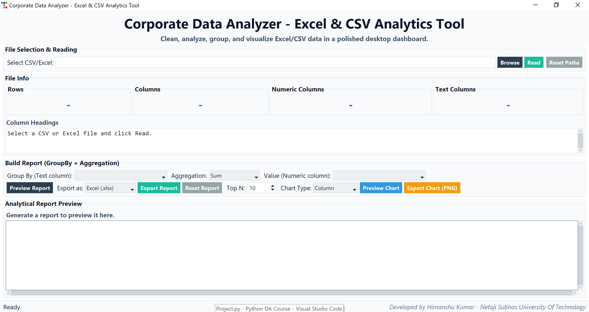
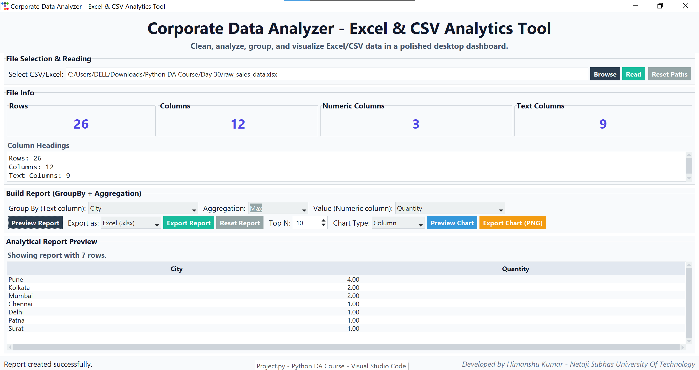
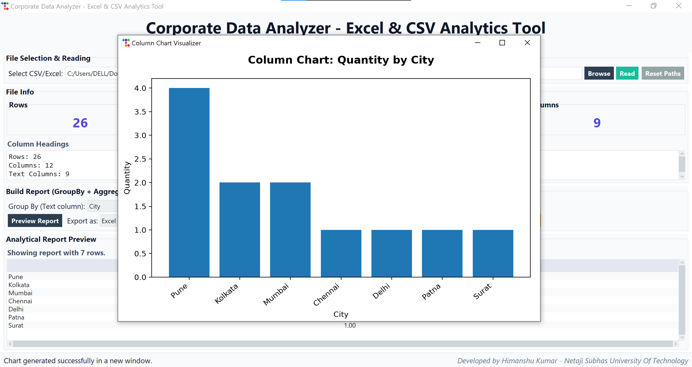
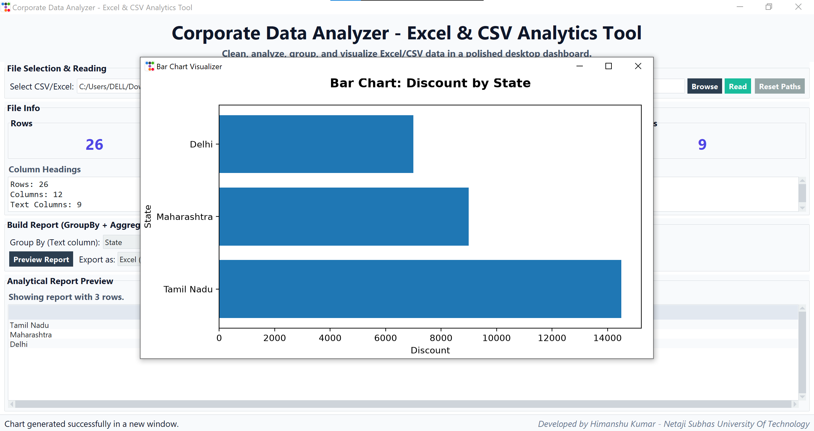
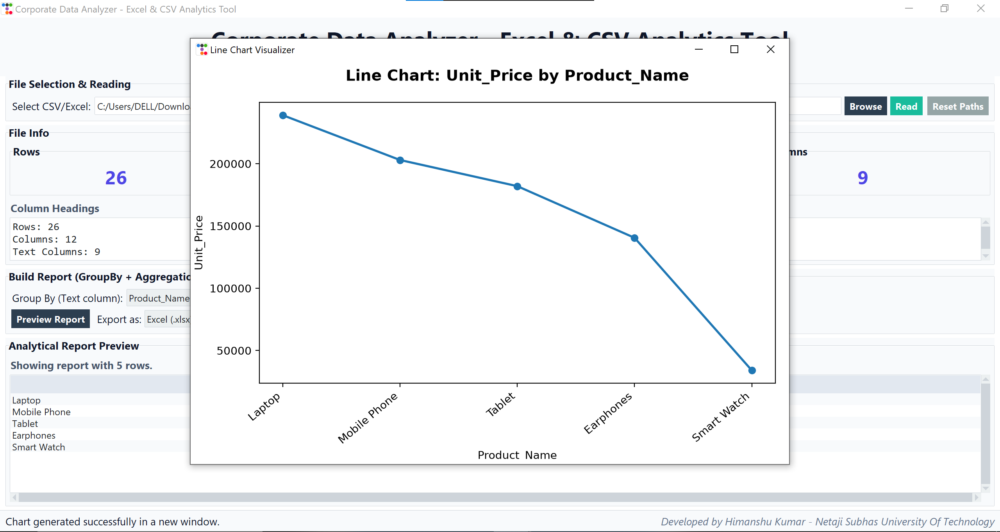
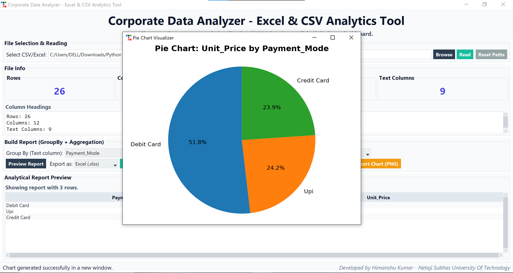

# Corporate Data Analyzer - Excel & CSV Analytics Tool

A Python desktop application for analyzing, grouping, and visualizing Excel/CSV datasets with an interactive GUI.

Developed using **Python**, **Tkinter**, **Pandas**, **Matplotlib**, and **ttkbootstrap**.

---

## Features

✅ Read CSV and Excel (.xlsx) files  
✅ Display dataset information (Rows, Columns, Numeric & Text Columns)  
✅ GroupBy operations on categorical columns  
✅ Multiple aggregation functions:
- Sum
- Mean
- Average
- Max
- Min
- Count
- Median

✅ Generate interactive charts:
- Column Chart
- Bar Chart
- Line Chart
- Pie Chart

✅ Export reports as:
- Excel (.xlsx)
- CSV (.csv)

✅ Export charts as PNG images

---

## Technologies Used

- Python 3
- Tkinter
- ttkbootstrap
- Pandas
- Matplotlib
- OpenPyXL

---

## Project Structure

```text
Corporate-Data-Analyzer
│
├── charts
│   ├── bar_chart.png
│   ├── column_chart.png
│   ├── line_chart.png
│   └── pie_chart.png
│
├── sample_data
│   ├── raw_sales_data.csv
│   └── raw_sales_data.xlsx
│
├── corporate_data_analyzer.py
├── dashboard_preview.png
├── report_preview.png
├── requirements.txt
├── README.md
├── LICENSE
└── .gitignore
```

---

## Dashboard Preview



---

## Analytical Report Preview



---

## Chart Previews

### Column Chart



### Bar Chart



### Line Chart



### Pie Chart



---

## Installation

### 1. Clone the repository

```bash
git clone https://github.com/himanshu-kumar2203/corporate-data-analyzer.git
```

### 2. Move to the project directory

```bash
cd corporate-data-analyzer
```

### 3. Install dependencies

```bash
pip install -r requirements.txt
```

### 4. Run the application

```bash
python corporate_data_analyzer.py
```

---

## Sample Dataset

Sample CSV and Excel files are available in the `sample_data` folder for testing the application.

---

## Future Improvements

- Dark Mode
- More chart customization options
- PDF report export
- Machine Learning insights
- Database connectivity (MySQL/PostgreSQL)

---

## Author

**Himanshu Kumar**  
B.Tech Information Technology  
Netaji Subhas University Of Technology (NSUT), Delhi

---

## License

This project is licensed under the MIT License.
